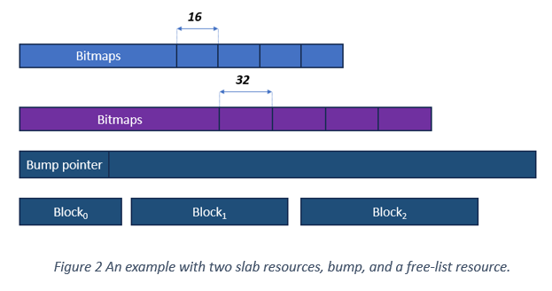

# Memory Resources

For each of the different memory spaces we manage the memory via a memory resource abstraction that serves the functionality of an allocator and offers APIs for allocate and deallocate. Any of these memory resources is built on top of the idea of *composability* where a memory resource is *composed* of different kinds of memory resources.
When a memory request (e.g., allocate) reaches the memory resource, the memory resource decides on which of the underlying memory resources it would delegate the request to. We build our global resource on top of two main design principles:
1. compose a global resource of multiple simple ones, and
2. make the common case fast and attempt to satisfy requests via a fast path.

We offer three different thread-safe memory resources that a global
memory resource can delegate its requests to:

1.  Fixed-size slab memory resource: a resource templated with a slab
    size *S* that can satisfy requests of size less or equal to S. The
    memory region owned by the resource contains a set of bitmaps where
    every single bit indicates whether the slab is used or not and the
    slabs in the user region.

2.  Bump memory resource: a resource that bumps a pointer on each
    allocation. The resource maintains a count of the allocated bytes
    followed by the user-addressable region and a mutex to protect the memory.
    Notice that this resource does not support free memory, however, with composability we can
    build a more powerful allocator.

3.  Free-list memory resource: a resource that does not own memory and
    only manages previously allocated memory blocks. Each time the
    resource user deallocates a memory block of any size, the block is
    treated as a linked-list node and added to the head of a
    doubly-linked-list. Each linked-list node (i.e., memory block)
    stores the current block size, and previous and next linked-list
    nodes (or null if at the start or the end of the linked-list,
    respectively).

```cpp
L2SPResource* getDefaultL2SPResource();
MainMemoryResource* getDefaultMainMemoryResource();

class MainMemoryResource {
  GlobalPtr<void> allocate(std::size_t bytes, std::size_t alignment = alignof(std::max_align_t));
  void deallocate(GlobalPtr<void> p, std::size_t bytes, std::size_t alignment = alignof(std::max_align_t));
  bool operator==(const MainMemoryResource& rhs);
  bool operator!=(const MainMemoryResource& rhs);

  // MainMemoryResource is neither copyable or moveable
  MainMemoryResource(const MainMemoryResource&) = delete;
  MainMemoryResource(MainMemoryResource&&) = delete;
  MainMemoryResource& operator=(const MainMemoryResource&) = delete;
  MainMemoryResource& operator=(MainMemoryResource&&) = delete;
 };

 class L2SPResource {
  GlobalPtr<void> allocate(std::size_t bytes, std::size_t alignment = alignof(std::max_align_t));
  void deallocate(GlobalPtr<void> p, std::size_t bytes, std::size_t alignment = alignof(std::max_align_t));
  bool operator==(const L2SPResource& rhs);
  bool operator!=(const L2SPResource& rhs);

  // L2SPResource is neither copyable or moveable
  L2SPResource(const MainMemoryResource&) = delete;
  L2SPResource(MainMemoryResource&&) = delete;
  L2SPResource& operator=(const L2SPResource&) = delete;
  L2SPResource& operator=(L2SPResource&&) = delete;
 };
```



Composing a powerful general-purpose memory resource using the aforementioned resources is simple. For example, in our design, the global main memory resource is composed of multiple slab resources, a bump resource and a free-list resource that maintain previously allocated memory blocks via the bump resource. Notice that all the bitmaps and control bits live in the same memory region (e.g., the main memory control bits live in HBM) but we discuss further optimization in a later section. The division of memory between these resources is determined by analyzing existing workloads targeting PANDO architecture and may be optionally set via runtime environment variables.

The two APIs we offer are "getMainMemoryResource" and "getL2SPMemoryResource" where the API returns a memory resource object that supports allocate and deallocate calls. Notice that these memory-resource objects are aware of the location where the call happens. For instance, if a user on PXN *x* requests the main memory resource, they would receive the memory object that will attempt to allocate memory from the nearest HBM.

## Optimizations

We next describe a few optimizations that we *may* investigate based on analyzing workload that target the PANDO hardware. The optimizations generally fall into two categories (1) aggregation, and (2) distributing control bits. For any of the resources, the aggregation of allocations can be implemented in similar fashions. Instead of performing allocations from different FGMT threads separately, we will aggregate these allocations and attempt to allocate them via a single call to the allocator. This optimization aims at reducing contention, but it would require additional logic and communication between FGMT threads (or via using collectives). We describe the two approaches for the different resources below.

### Slab memory resource

The goal of a Slab memory resource is to offer extremely fast memory allocations and deallocation (mainly for small allocations) and to serve that purpose we propose the following privatization optimization where we distributed bitmaps. A call to a "get\*Resource" would *cache* bitmaps throughout the memory hierarchy (i.e., in L2SP and/or in registers). On an allocate call, the resource instance would first attempt to find the next available memory block in registers then use that information to update the global state (e.g., in L2SP or main memory). Notice that registers may have *stale* data, yet they can still serve as an optimistic fast path for detecting the next free block. After checking the cached bitmaps (in registers or other levels), we attempt to set the bit that maps to the free slab in the global state via an atomic operation. If the atomic operation fails, we update the cached state and try again (typically atomic operations return the current value which we will use as the new state). The goal of this optimization is to minimize contention over global bitmaps.

### Bump memory resource

The bump memory resource aims at satisfying allocation requests that are of medium to large size. From our workload analysis, these large allocations tend to be less frequent and hence the following optimizations are only useful if the bump memory resource is ever in the critical path. The distribution of the bump pointers idea is achieved by breaking down the pools of memory into evenly distributed chunks that satisfy the requests from nearby cores. Whenever one of these resources is completely used, then the allocation call would attempt to allocate from nearby cores resources.

### Free-list memory resource

Distributing the free-list memory resource control is not trivial since the control bits reside in memory that was previously allocated by the
user and allocations are generally satisfied by first-fit strategies. Moreover, this resource is not used until all memory resources are fully
utilized (i.e., the resource servers as the last option for satisfying allocations). Nevertheless, if the free-list allocate calls are ever on
the critical path we can decouple the control bits from the user-addressable region and build an acceleration structure on top of
the memory blocks. The acceleration structure stores memory block sizes and pointers as key-value pairs into a tree structure (e.g., B-Tree).
The overhead of the tree needs to be justified by (1) improving the search for the best-fit memory block and hence reducing internal
fragmentation, and (2) reducing the overhead of traversing the linked-list stored in a main memory.
